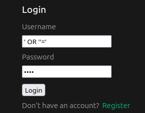

### **Website Security Research Project**  
⚠️ **Warning!** This is the **SQL injection vulnerable branch**. Use this branch to explore SQL injection vulnerabilities. The more secure branch is named **"sql_injection_secure"**.

---

### **Branches**
Before setting up the environment and running the application, note that this project uses **git branches** to demonstrate different levels of security.  

The general naming convention is:
- `[attack method]_secure` → More secure version
- `[attack method]_vulnerable` → Vulnerable version

To run the application with an **SQL injection vulnerability**, after cloning the repo, run:
```bash
git fetch
git checkout sql_injection_vulnerable
git pull origin sql_injection_vulnerable
```
Then, follow the setup instructions below.

---

### **Set Up Instructions to Test**
The first steps to get the project running are to create a **virtual environment**.

#### **1️⃣ Install VirtualBox**
[Oracle VirtualBox](https://www.virtualbox.org/) is a free tool that lets you run **virtual machines (VMs)** on your computer. You’ll need it to create a separate, controlled environment for this project.

1. Download and install **VirtualBox** from:  
   🔗 [https://www.virtualbox.org/](https://www.virtualbox.org/)

---

#### **2️⃣ Install Ubuntu 22.04 LTS (Virtual Machine)**
🖥 **What is Ubuntu & Why are We Using It?**  
Ubuntu is a popular, free **Linux-based operating system**. We use it because it provides a secure and consistent development environment that closely resembles real-world web servers.

To set up an **Ubuntu virtual machine (VM)**:
1. Download Ubuntu 22.04 LTS (or later) from:  
   🔗 [https://releases.ubuntu.com/jammy/](https://releases.ubuntu.com/jammy/)
2. Open **VirtualBox**, click **New**, and:
   - Name: `Ubuntu 22.04` or current 
   - Type: `Linux`
   - Version: `Ubuntu (64-bit)` or appropriate option for your machine
   - Memory: At least **??GB RAM** (recommended)
   - Storage: At least **??GB+ dynamically allocated disk**
3. Attach the **Ubuntu ISO** and install it inside the VM.
4. Once installed, **log into Ubuntu** and open a **terminal** .

---

#### **3️⃣ Install Required Packages**
Inside the **Ubuntu terminal**, run:
```bash
sudo apt update && sudo apt install git python3.10-venv curl -y
```
- `git` → Needed to clone the project repository.  
- `python3.10-venv` → Creates an isolated Python environment.  
- `curl` → Fetches files from the web.  

---

#### **4️⃣ Clone This Repository**
Once Ubuntu is set up, **clone the project** into your virtual environment:
```bash
git clone https://github.com/ted-miller92/wsrp.git
cd wsrp
```

## Database 

Install MySQL:

`wget https://dev.mysql.com/get/mysql-apt-config_0.8.33-1_all.deb`

`sudo dpkg -i mysql-apt-config_0.8.33-1_all.deb`

`sudo apt update`

`sudo apt install mysql-server`

Choose a memorable password for the root user.

Start MySQL and enter the password you just created:

`mysql -u root -p`

Create the database with the script:

`source database_setup_v0.sql`

## Server/API

Set up server

`python3 -m venv server_env`

`source server_env/bin/activate`

`pip install -r requirements.txt`

`flask --app server.py run`

At this point you should be able to access the API endpoints in the browser. 

## Frontend / Vue

Make sure node is installed via Node Version Manager. Download and install nvm:

`curl -o- https://raw.githubusercontent.com/nvm-sh/nvm/v0.40.1/install.sh | bash`

Verify version:

`nvm --version`

Should show the version specified in the `curl` command above.

Now install node:

`nvm install node`

The latest version will be installed. Change to the `wsrp_vue` directory. Install dependencies:

`npm install`

Start the vue front end with the following command:

`npm run dev`

Or build with:

`npm run build`


## Testing it out

The first feature that is "testable" is SQL injection. Open a web browser and navigate to `localhost:5173/login`. In the Username field enter `' OR ''='` with single quotes, as pictured below:



Enter anything for the Password field. Before clicking "Login", open the web browser console (On Firefox, right-click > "Inspect"). After submitting the login form you will not be directed anywhere, but in the console you will see a list of all of the users in the database.

When you switch to the "sql_injection_secure" branch and run the application (using the same steps from above) you will not be able to run this specific attack. 
