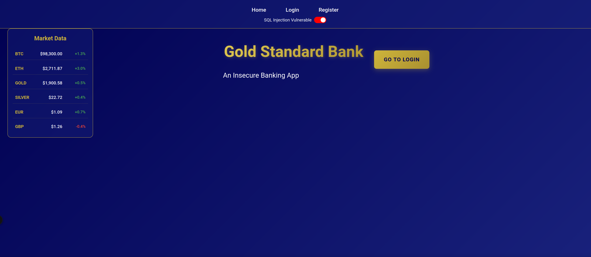
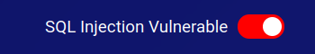

## Exploration Guide

You should now see a web application that appears to be a reputable and trustworthy banking application. 

Poke around a little bit. You can see a login page and a register page. You will also notice some toggle buttons on the navigation bar. These buttons are used to enable and disable various security features of the application. 

When one of these toggles is set to "vulnerable" (indicated with red), the application is vulnerable to the security flaw indicated by the toggle. For example, if the "SQLi" toggle is set to "vulnerable", the application is vulnerable to SQL injection attacks.

Visit any of the sections below to see if you can take advantage of these vulnerabilities

[SQL Injection](vulnerabilities/sqli.md)

[Cross-Site Scripting](vulnerabilities/xss.md)

[Cross-Site Request Forgery](vulnerabilities/csrf.md)
