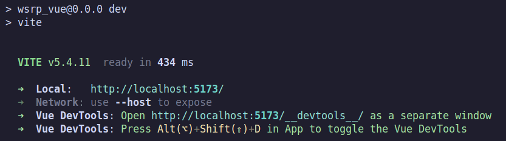

# Website Security Research Project
- [Website Security Research Project](#website-security-research-project)
  - [Introduction](#introduction)
  - [Setup Instructions](#setup-instructions)
    - [Virtual Environment](#virtual-environment)
    - [Database](#database)
    - [Server](#server)
    - [Front End](#front-end)
  - [Exploring Vulnerabilities](#exploring-vulnerabilities)
    - [SQL Injection](#sql-injection)

This document is the full guide to setup, use and explanation of this project. The intended audience is anyone who wishes to use and explore the Website Security Research Project. 

## Introduction

This is an application that is meant to explore common security vulnerabilities in web applications. Everything to launch a full-stack web application is included in this repository, including set up instructions and details on the various vulnerabilities explored. 

The application itself is a lightweight banking application, in which a user can log in as a customer or an employee, access account details and view transactions. 

The database is a MySQL relational database. The server is a Python Flask application, and the front end uses the Vue.js framework. 

> [!WARNING]
> Beacuse of the security vulnerabilities intentionally included in this application, we advise anyone trying it out to do so inside of a virtual machine. We have chosen VirtualBox running an instance of Ubuntu 22.04 as our virtual environment, which is covered in [Setup Instructions](#setup-instructions)

## Setup Instructions

There are four main steps to set up this project in order to interact with it:

1. Set up virtual environment
2. Create and run database instance
3. Set up Flask server
4. Set up Vue.js front end

These steps should be completed in order. 

### Virtual Environment

Install Oracle Virtual Box. Depending on your operating system, install one of the packages or installers listed on the [Oracle VirtualBox Download Page](https://www.oracle.com/virtualization/technologies/vm/downloads/virtualbox-downloads.html). 

Download the ISO image for [Ubuntu 22.04 (Jammy Jellyfish)](https://www.releases.ubuntu.com/22.04/). Choose the "Desktop Image", since we will be wanting to interact via the GUI. 

Follow the steps to [install Ubuntu 22.04 in Virtualbox](https://itslinuxfoss.com/install-ubuntu-22-04-virtualbox/). 

When the virtual machine is installed and running, you should be able to log in as the user you created. Open a terminal, then enter the following command to install a few necessary packages:

`sudo apt install git python3.10-venv curl`

Clone this repository, then navigate to the root directory of the project:

`git clone https://github.com/ted-miller92/wsrp.git`

`cd wsrp`

### Database

Install MySQL:

`wget https://dev.mysql.com/get/mysql-apt-config_0.8.33-1_all.deb`

`sudo dpkg -i mysql-apt-config_0.8.33-1_all.deb`

`sudo apt update`

`sudo apt install mysql-server`

Choose a memorable password for the root user.

Start MySQL and enter the password you just created:

`mysql -u root -p`

Create the database with the script, then exit MySQL:

`source database_setup_v0.sql;`

`exit;`

### Server

Navigate to the server directory with `cd server`.

Create a python virtual environment, then activate it:

`python3 -m venv server_env`

`source server_env/bin/activate`

Install the required packagegs and then run the app:

`pip install -r requirements.txt`

`flask --app server.py run`

At this point you should be able to access the API endpoints in the browser. 

### Front End

Navigate to the `wsrp_vue` directory.

Vue.js runs on Node. We will use Node Version Manager (`nvm`) to install Node. 

`curl -o- https://raw.githubusercontent.com/nvm-sh/nvm/v0.40.1/install.sh | bash`

Verify version:

`nvm --version`

Should show the version specified in the `curl` command above. Now install Node:

`nvm install node`

The latest version will be installed. Double check that you are in the `wsrp_vue` directory then install dependencies:

`npm install`

Run the front end server:

`npm run dev`

You should now be able to access the application at the URL printed in the terminal. 

## Exploring Vulnerabilities

### SQL Injection

