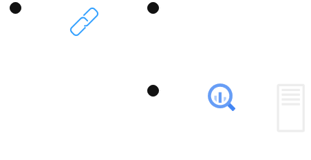

# General Research about common web application vulnerabilities
- [General Research about common web application vulnerabilities](#general-research-about-common-web-application-vulnerabilities)
  - [CSRF (Cross-Site Request Forgery)](#csrf-cross-site-request-forgery)
  - [SQL Injection](#sql-injection)

## CSRF (Cross-Site Request Forgery)

A few things have to be true for CSRF to be possible:
- The user (victim) must be logged in (authenticated) to the target website
- The target website uses cookie based session management
- Request parameters (handled by the website) must be somewhat predictable.

The attacker sends a link to the victim which contains a hidden request to the server. When the victim clicks the link, the request is sent to the target website, "hijacking" the victim's session to make an authenticated request. 

  

The request may have hidden parameters that the attacker can control, such as a request to change the user's (victim's) email address to that of the attacker. 

If this request is sent successfully, the attacker can then try to log in to the victim's account to request a password change. After this, the attacker basically has full access to whatever the victim has access to.

To try this out on your own...

## SQL Injection

'''General info about SQL injection here'''

Here is a request that takes advantage of an endpoint in the server that is vulnerable to SQL injection:

  

This example is convuluted and obviously staged, but it shows how an attacker may be able to insert characters into a request to manipulate the SQL query that the server is running. In this case, the attacker is able to insert a ' character into the request, which causes the SQL query to be malformed. The attacker can then use this to manipulate the query to return all of the users in the database, which is a huge security risk.